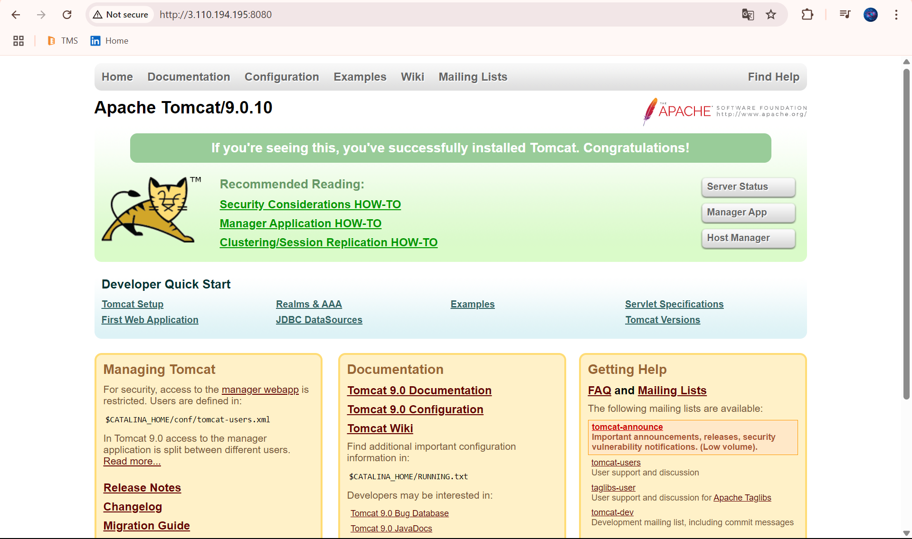

# Manual Installation and Configuration of Apache Tomcat 9 on Ubuntu


This guide walks through the manual installation and setup of Apache Tomcat 9 on an Ubuntu system.

---

## 🛠️ Step 1 - Update System

```bash
apt update -y
```

---

## ☕ Step 2 - Install Java Development Kit (JDK)

```bash
sudo apt install default-jdk -y
```

---

## 📦 Step 3 - Set the Tomcat Version

```bash
TOMCAT_VERSION=9.0.10
```

---

## 📁 Step 4 - Create Tomcat Installation Directory

```bash
sudo mkdir -p /opt/tomcat
```

---

## 🌐 Step 5 - Download Apache Tomcat Archive

```bash
wget https://archive.apache.org/dist/tomcat/tomcat-9/v${TOMCAT_VERSION}/bin/apache-tomcat-${TOMCAT_VERSION}.tar.gz
```

---

## 📂 Step 6 - Extract Tomcat Archive to Installation Directory

```bash
sudo tar -xvzf apache-tomcat-${TOMCAT_VERSION}.tar.gz -C /opt/tomcat --strip-components=1
```

---

## ✅ Step 7 - Make Shell Scripts Executable

```bash
sudo chmod +x /opt/tomcat/bin/*.sh
```

---

## ▶️ Step 8 - Start Tomcat Server

```bash
/opt/tomcat/bin/startup.sh
```

---

## ⚙️ Step 9 - Configuration Setup

1. Click **Manager App**
2. If you see an error, continue to next step.

---

## 🔐 Step 10 - Configure Access For the Manager Web App

```bash
sudo nano /opt/tomcat/webapps/manager/META-INF/context.xml
```

Replace content with:

```xml
<Context antiResourceLocking="false" privileged="true" >
  <Valve className="org.apache.catalina.valves.RemoteAddrValve"
         allow=".*" />
</Context>
```

---

## 🔄 Step 11 - Restart Tomcat Server

```bash
/opt/tomcat/bin/shutdown.sh
/opt/tomcat/bin/startup.sh
```

---

## 👤 Step 12 - Create Admin User for Tomcat GUI

```bash
sudo nano /opt/tomcat/conf/tomcat-users.xml
```

Add the following inside `<tomcat-users>`:

```xml
<role rolename="manager-gui"/>
<user username="admin" password="admin" roles="manager-gui"/>
```

---

## 🔁 Step 13 - Final Restart to Apply Changes

```bash
/opt/tomcat/bin/shutdown.sh
/opt/tomcat/bin/startup.sh
```

---

## 🌐 Step 14 - Run Project & Sign In

- Visit: `http://<Your-IP>:8080`
- Username: `admin`
- Password: `admin`

---

## ✅ Step 15 - Final Output

You should now have access to the Tomcat Manager GUI with full configuration.

---

